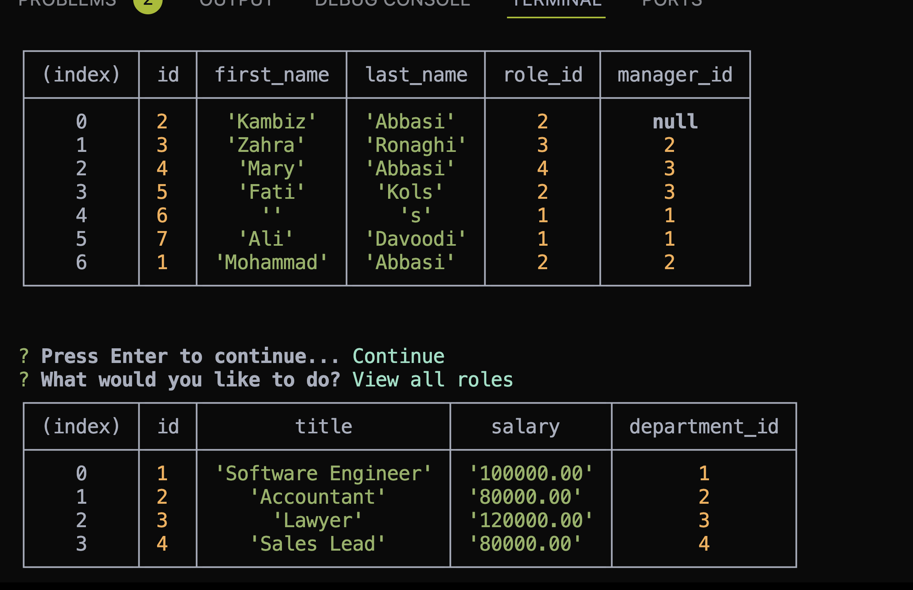

# employy

Employee Tracker

## Employee Management System Readme

This is a simple Employee Management System implemented using Node.js and PostgreSQL. The system allows users to perform various operations such as viewing employees, departments, and roles, adding new employees, departments, and roles, and updating employee roles.

## Dependencies

1-inquirer: This package is used for interactive command-line user interfaces. It allows the system to prompt users with questions and receive their input.

2-pool: The pool module is a custom connection pool to the PostgreSQL database. It's used for handling database connections efficiently.
Installation

3-Clone the repository to your local machine.
Install the dependencies using npm:

4-Copy code
npm install inquirer
Ensure you have a PostgreSQL server running locally or provide connection details in ./db/connection.js.

## Usage

This is sample pic:

This is sample video link: https://drive.google.com/file/d/1LnN80cgWqj2_G8rwb-ajjS8R-JDxbqW9/view

## Features

1-View all employees: Displays a table with information about all employees.

2-View all departments: Displays a table with information about all departments.

3-View all roles: Displays a table with information about all roles.

4-Add an employee: Prompts the user to enter information about a new employee and adds it to the database.

5-Add a department: Prompts the user to enter information about a new department and adds it to the database.

6-Add a role: Prompts the user to enter information about a new role and adds it to the database.

7-Update an employee role: Allows the user to update the role of an existing employee.

## Contributors

Mohammad Abbasi

## License

MIT License.
